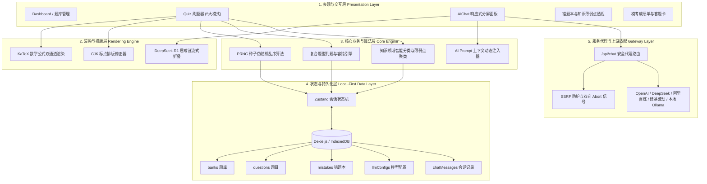

# LearnHelper Web (刷题助手 Web 版)

> 极简 · 高性能 · 本地优先（Local-First）的现代化备考刷题与 AI 深度辅导系统。  
> 纯前端驱动，数据 100% 存储于浏览器 IndexedDB，零后端数据库依赖，保障隐私与毫秒级响应。

---

## 核心架构设计

LearnHelper Web 采用五层分层架构设计（分层解耦、本地优先、流式响应）：



### 1. 表现与交互层 (Presentation Layer)
- **页面矩阵**：涵盖首页概览、题库管理、多模式刷题器、错题本透视、模考成绩单及全局设置。
- **自适应分屏**：刷题与 AI 答疑支持 `[ 分屏 | 底部 | 抽屉 ]` 三种响应式布局自由切换，布局偏好本地自动持久化。

### 2. 公式与富文本渲染层 (Rendering Engine)
- **双通道 LaTeX**：集成 `remark-math` 与 `rehype-katex`，支持行内公式（`$E=mc^2$`）与块级公式（`$$\int f(x)dx$$`），全场景覆盖题干、选项、解析及 AI 流式输出。
- **排版增强**：内置 CJK 标点修正算法，解决 Markdown 加粗与中文标点混排的排版兼容问题。

### 3. 核心业务与算法层 (Core Engine & Business Logic)
- **复合题型识别与判题引擎**：统一适配单选、多选以及组合式多空题（如 `(1)A (2)B` 题型），支持精准评分与容错解析。
- **种子乱序算法 (PRNG)**：基于确定性随机数种子洗牌算法，支持随机练习模式下的进度持久化与断点续做。
- **知识领域分类器**：基于规则与特征工程对考题进行知识领域聚类，支持刷题时防剧透隐藏及错题薄弱点统计。
- **Prompt 上下文注入**：自动将当前题目的全景数据（题干、选项、答案、错选、解析）组装为结构化 Prompt 注入大模型。

### 4. 本地优先存储层 (Local-First Storage)
- **状态机**：基于 Zustand 5 统一调度刷题会话生命周期，支持断点自动恢复与实时错题入库。
- **Dexie.js (IndexedDB)**：全量数据驻留浏览器本地，提供单题自定义解析编辑、解析就地合并更新、数据全量导入导出备份功能。

### 5. 服务代理与安全网关 (Edge Gateway & LLM Proxy)
- **安全防护**：内置 SSRF 白名单过滤与内网 IP 拦截，保护服务端安全。
- **流式转发**：基于 SSE (Server-Sent Events) 双向流式转发，客户端断开与 90s 超时双向中断机制。
- **长推理适配**：针对 DeepSeek-R1 等深度思考模型，动态扩展输出 Token 空间，防止推理链被截断。

---

## 刷题模式设计规范

基于认知心理学中的“检索提取练习（Retrieval Practice）”与“即时强化反馈”理论，系统提供 5 大练习形态：

| 模式 | 交互形态 | 反馈机制 | 适用阶段与目的 |
| :--- | :--- | :--- | :--- |
| **顺序练习** (`sequential`) | 单选即点即判，多选提交后判题 | **即时反馈**（立即呈现对错、标准答案与官方解析） | 主力攻坚阶段，即刻纠正认知盲区。 |
| **随机练习** (`random`) | 基于随机数种子（Seed）乱序抽题 | **即时反馈** | 打破顺序记忆惯性，杜绝按题号死记答案。 |
| **全真模考** (`exam`) | 答题时不锁死选项，支持任意修改与翻题 | **延迟反馈**（做题中隐藏答案，交卷后出具成绩单与全解析） | 考前模拟真实考场压力，检验综合实战水平。 |
| **背诵模式** (`recite`) | 题目下方常驻展开正确答案与官方解析 | **免答直读** | 零基础快速通读考点大纲。 |
| **错题复习专场** (`mistakes`) | 错题本一键发起独立练习会话 | **闭环专练**（答对自动移出错题本） | 针对错题反复巩固，直至彻底掌握。 |

---

## 数据存储架构 (IndexedDB Schema)

```typescript
// 数据库版本: LearnHelperDB v1 (基于 Dexie.js)
db.version(1).stores({
  questions: '++id, bankId, type',
  banks: '++id, name, createdAt',
  mistakes: '++id, questionId, bankId, createdAt',
  llmConfigs: '++id, name, isActive',
  chatMessages: '++id, questionId, role, createdAt'
});
```

---

## 技术栈与工程规范

### 核心技术栈
- **框架**：Next.js 16.3.1 (Turbopack, App Router)
- **UI 运行时**：React 19.2 + CSS Modules (零冗余依赖，极简轻量)
- **状态管理**：Zustand 5 (带 localStorage 持久化)
- **本地存储**：Dexie.js 4 (IndexedDB 包装层)
- **公式与富文本**：KaTeX + react-markdown + remark-math + rehype-katex + remark-gfm
- **内置题库**：历年系统架构设计师真题（609 题，100% 完整答案）

### Commit 提交规范
本项目遵循 [Conventional Commits](https://www.conventionalcommits.org/) 规范，保持提交历史干净、明确且易于溯源：

```
<type>(<scope>): <description>

例如:
feat(quiz): 支持组合式多空题判题与人类可读格式化
fix(ai): 增加上游请求 90s 超时与客户端断开中止机制
refactor(ui): 替换错题本 Emoji 为矢量图
docs(readme): 完善五层核心架构图与项目背景说明
```

常用 `type` 清单：
- `feat`: 新增功能
- `fix`: 修复缺陷
- `refactor`: 重构代码（不引入新功能亦不修复 Bug）
- `perf`: 性能优化
- `docs`: 文档变更
- `style`: 代码格式与排版微调
- `chore`: 构建系统、依赖更新或配置维护

---

## 项目背景与参考

本项目（**LearnHelper Web**）的概念与题库数据集参考自开源项目 **[qyn1126/LearnHelper](https://github.com/qyn1126/LearnHelper)**（Python/PyQt 桌面端刷题工具）。

本项目基于该题库体系，进行了纯 Web 与 Local-First 架构重构，引入了 Next.js 16 现代运行时、流式 AI 深度思考辅导、KaTeX 公式实时渲染引擎及自适应分屏交互，提供跨平台、免安装、离线可用的学习环境。

---

## 启动与构建

```bash
# 1. 安装依赖
npm install

# 2. 启动本地开发
npm run dev

# 3. 代码规范检查 (0 警告 0 报错)
npm run lint

# 4. 生产构建打包
npm run build
```
